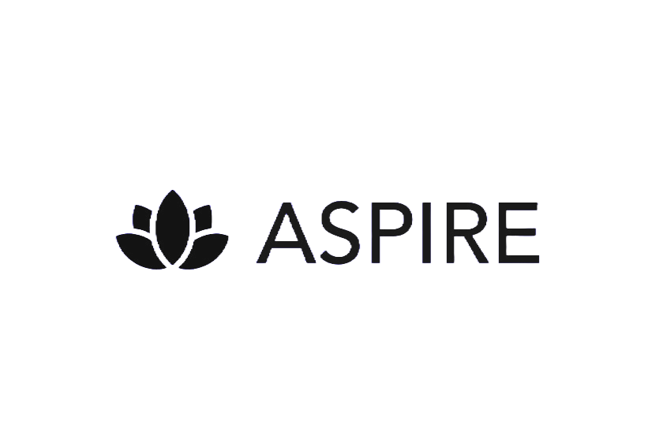

Here’s a modern, well-structured version of your GitHub README file for ASPIRE:

---

# _**ASPIRE - AYUSH *S*tartup *P*ortal for *I*nnovation, *R*egistration and *E*mpowerment**_  
#### *Team Genesis - Pre SIH 2023*

---

  

---

## Table of Contents
- [Project Description](#project-description)
- [Key Features](#key-features)
- [Flowchart](#flowchart)
- [Figma Design](#figma-design)
- [Tech Stack](#tech-stack)
- [Team Members](#team-members)

---

## 📝 Project Description

ASPIRE is on a mission to revolutionize the entrepreneurial ecosystem in India, with a special focus on the **AYUSH sector**. The platform serves as a one-stop destination for aspiring entrepreneurs, mentors, and investors, promoting **innovation, collaboration**, and **economic growth** in various sectors of entrepreneurship. 

By simplifying the registration and business development processes, ASPIRE seeks to foster a culture of entrepreneurship and accelerate India's journey toward becoming a global leader in AYUSH-based innovation.

### Key Features:
- **Streamlined AYUSH Startup Registration**
  - Automated dynamic application process with OCR.
  - DigiLocker integration for document verification.
  - Multi-factor authentication (MFA) and AWS Firewall security.

- **Marketplace for AYUSH Products**
  - In-app marketplace for startups to showcase and promote their products.
  - Digital Ayurveda Passport (DAP) for regulatory compliance.

- **Investor and Entrepreneur Ecosystem**
  - NLP-based multilingual chatbot for seamless communication.
  - Investor coin system to redeem AYUSH certifications or vouchers.
  - Pre-approval and compliance checks for startups.
  
- **Mentorship and Learning**
  - Access to mentorship programs and collaboration opportunities within the platform.
  - Personalized user dashboards for tracking progress and notifications.

---

## 📊 Flowchart

  

---

## 🎨 Figma Design

Explore our [Figma Design](https://www.figma.com/design/mKsvTmddyMeRvnxvjhVpB7/AYUSH?node-id=0-1&t=GGjsCOyYIXbAp50p-1) for detailed wireframes and prototypes.

---

## 🤖 Tech Stack

### **Frontend**
- React.js
- Tailwind CSS
- Chakra UI

### **Backend**
- Node.js
- Socket.IO

### **Database**
- MongoDB

### **APIs**
- Finnhub API
- DigiLocker API

### **Machine Learning**
- Natural Language Processing (NLP)

---

## 👩‍💻 Team Members

- [T V Vishalkirthik](https://github.com/username)
- [Sarang Kadukar](https://github.com/username)
- [Sholk Talhar](https://github.com/username)
- [Atharva Dhote](https://github.com/username)
- [Mayuri Anandikar](https://github.com/username)
- [Yashraj Kulkarni](https://github.com/username)

---

  

---

## 📄 License
This project is licensed under the [MIT License](https://opensource.org/licenses/MIT).

---

By structuring it this way, the README is clear, modern, and visually appealing. You can customize the images and links as needed.